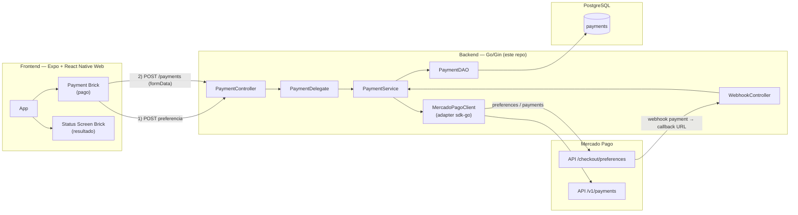
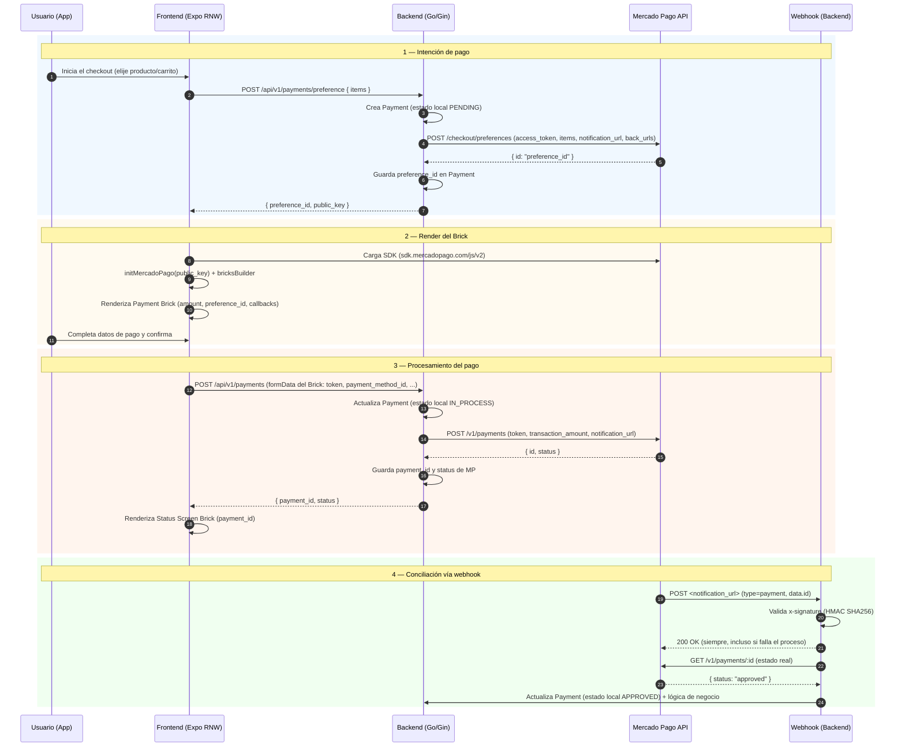
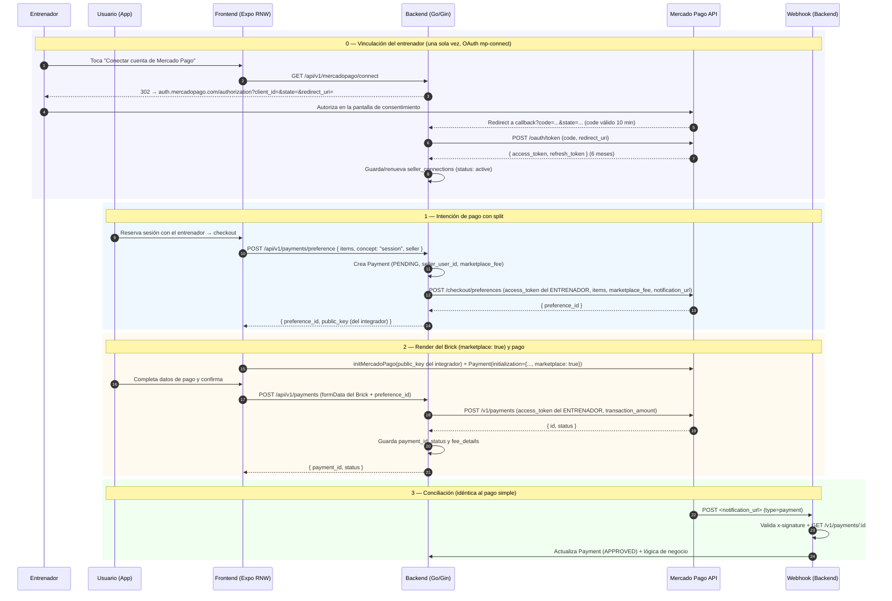

# Integración de pagos con Checkout Bricks — Plan de integración

> Documento de diseño y plan de tareas para integrar pagos con Mercado Pago usando **Checkout Bricks** (frontend) + **backend Go/Gin** (este repo) + **Webhooks** para conciliar estados.
>
> Hay **dos flujos de pago, ambos contemplados desde el modelo de datos inicial** (ver [sección 6](#6-modelo-de-datos-inicial--tabla-payments)):
> - **Sin split:** el usuario le paga a la app de Paceron — por una **orden de pago** o por la **cuota de suscripción**. Un solo vendedor (Paceron); el importe completo entra a la cuenta MP de Paceron.
> - **Con split:** el usuario le paga al **entrenador** — modelo marketplace, Paceron cobra su comisión vía `marketplace_fee`. Ver [Split payments (marketplace)](#split-payments-marketplace).

---

## 1. Objetivo

Que un usuario pueda pagar desde la app (Expo/React Native + React Native Web) usando el **Payment Brick** de Mercado Pago, que el backend cree la preferencia, procese el pago y reciba el estado final vía **webhook** para persistirlo en la tabla `payments`.

El modelo contempla desde el inicio **dos tipos de pago**, diferenciados por el campo `concept` en `payments`:

| `concept` | ¿Quién cobra? | ¿Quién paga? | Ejemplos |
|---|---|---|--|
| `order` | Paceron (la app) | Usuario | Orden de pago (compra de un producto/servicio de la app) |
| `subscription` | Paceron (la app) | Usuario | Cuota de suscripción (tier) |
| `team_subscription` | Entrenador (su cuenta MP) | Usuario (corredor) | Cuota de membresía al equipo; Paceron cobra su comisión (`marketplace_fee`) |

- **Sin split** (`order` / `subscription`): el caso más simple — un solo vendedor (Paceron) y el importe completo entra a la cuenta MP de Paceron. `marketplace_fee` y `seller_user_id` quedan `null`.
- **Con split** (`team_subscription`): el importe entra a la cuenta MP del entrenador y Paceron retiene su comisión. Ver [Split payments (marketplace)](#split-payments-marketplace).

Todo respetando la arquitectura en capas del repo: `Controllers → Delegates → Services → DAOs/RestClients → Infrastructure`.

---

## 2. Piezas que participan

| Pieza | Responsabilidad |
|---|---|
| **Frontend (Expo RNW)** | Renderiza el Payment Brick (y luego Status Screen Brick). Envía al backend la intención de pago y los datos que el Brick genera al enviar. |
| **Backend (Go/Gin, este repo)** | Crea la preferencia en Mercado Pago, procesa el pago con el token generado por el Brick, recibe/valida webhooks, persiste estados en `payments`. **Nunca** maneja datos de tarjeta (eso lo hace el Brick). |
| **Mercado Pago API** | Crea la preferencia (`/checkout/preferences`), procesa el pago (`/v1/payments`), y dispara notificaciones webhook. |
| **Webhook (backend)** | Endpoint público que recibe notificaciones `payment`, valida la firma (`x-signature`), consulta el pago real y actualiza el estado local. |

> **SDK oficial (decisión):** el backend usa `github.com/mercadopago/sdk-go` (paquetes `preference`, `payment`, `webhook`, `oauth`, `requestoptions`) en vez de un RestClient propio contra la API HTTP. El SDK cubre: crear preferencia (`preference.Client.Create`), crear pago (`payment.Client.Create`, idempotencia vía `requestoptions.WithIdempotencyKey`), consultar pago (`payment.Client.Get`), **validar firma del webhook** (`webhook.ValidateSignature`, HMAC-SHA256 en tiempo constante) y el exchange de OAuth mp-connect (`oauth.Client.Create`). Solo se agrega código propio para orquestar el flujo, no para hablar con la API.
>
> **Nota de plataforma:** Payment Brick es un componente **web** (HTML/JS). En este repo el frontend es Expo/React Native + React Native Web, así que Bricks renderiza correctamente en la versión *web* de la app. Para la app nativa (iOS/Android) Bricks no aplica directamente: habría que evaluar Checkout Pro mobile (redirección) o un WebView con la versión web. Ver [Tareas frontend](#7-tareas-frontend).
>
> **SDK React para Bricks (confirmado):** existe el paquete oficial `@mercadopago/sdk-react` (npm). Expone un componente React por cada brick (`Payment`, `StatusScreen`, `Wallet`, `CardPayment`, `Brand`) más `initMercadoPago(publicKey)` para inicializar. Es client-side (web) → compatible con la versión web del frontend Expo/React Native.
> ```jsx
> import { initMercadoPago, Payment, StatusScreen } from '@mercadopago/sdk-react';
> initMercadoPago('PUBLIC_KEY');
> <Payment initialization={{ amount, preferenceId }} onSubmit={...} onReady={...} onError={...} />
> <StatusScreen initialization={{ paymentId }} />
> ```

---

## 3. Diagrama de arquitectura



---

## 4. Flujo de un pago simple — paso a paso



---

## 5. Detalle por paso

### Paso 1 — Crear la preferencia (BACKEND)

- Endpoint: `POST /api/v1/payments/preference`
- Body de ejemplo:
  ```json
  {
    "items": [
      { "title": "Servicio de entrenamiento", "quantity": 1, "unit_price": 10000.00 }
    ],
    "description": "Pago de sesión"
  }
  ```
- El backend valida (monto > 0, items no vacíos), persiste un `Payment` en estado `pending` y llama a Mercado Pago:

  ```http
  POST https://api.mercadopago.com/checkout/preferences
  Authorization: Bearer <ACCESS_TOKEN>
  Content-Type: application/json
  ```
  ```json
  {
    "items": [{ "title": "Servicio de entrenamiento", "quantity": 1, "unit_price": 10000.00 }],
    "notification_url": "https://api.paceron.com/webhooks/mercadopago",
    "back_urls": { "success": "https://paceron-frontend.vercel.app/payment/result", "failure": "...", "pending": "..." },
    "auto_return": "approved"
  }
  ```
- Guarda el `preference_id` recibido y responde al frontend con `{ preference_id, public_key }`.

> La **`public_key`** se usa en el frontend (es pública). El **`access_token`** solo vive en el backend (secreto). `notification_url` debe ser una URL pública (no localhost).

### Paso 2 — Renderizar el Payment Brick (FRONTEND)

- Cargar SDK + inicializar con la `public_key`:
  ```js
  import { initMercadoPago, Payment } from '@mercadopago/sdk-react';
  initMercadoPago('PUBLIC_KEY');
  ```
- Render del brick:
  ```jsx
  const initialization = { amount: 10000, preferenceId: 'PREFERENCE_ID' };
  // MVP: solo tarjeta (decisión #2). `marketplace: true` + `preferenceId` solo para split (sección 5).
  const customization = { paymentMethods: { creditCard: 'all', debitCard: 'all' } };

  const onSubmit = async ({ selectedPaymentMethod, formData }) => {
    const res = await fetch(`${API}/api/v1/payments`, {
      method: 'POST',
      headers: { 'Content-Type': 'application/json' },
      body: JSON.stringify({ ...formData, preferenceId: 'PREFERENCE_ID' }),
    });
    const { payment_id, status } = await res.json();
    // mostrás el Status Screen Brick con payment_id
  };

  <Payment initialization={initialization} customization={customization}
           onSubmit={onSubmit} onReady={...} onError={...} />
  ```

### Paso 3 — Procesar el pago (BACKEND)

- Endpoint: `POST /api/v1/payments`
- Body recibido: lo que genera el Brick en `formData` (`token`, `payment_method_id`, `installments`, `payer.email`, etc.) + `preference_id`.
- El backend llama a Mercado Pago:

  ```http
  POST https://api.mercadopago.com/v1/payments
  Authorization: Bearer <ACCESS_TOKEN>
  X-Idempotency-Key: <uuid v4 del intento>
  ```
  ```json
  {
    "transaction_amount": 10000.00,
    "token": "<token del Brick>",
    "description": "Pago de sesión",
    "installments": 1,
    "payment_method_id": "visa",
    "payer": { "email": "comprador@example.com" },
    "notification_url": "https://api.paceron.com/webhooks/mercadopago",
    "external_reference": "<id interno del Payment>",
    "three_d_secure_mode": "optional"
  }
  ```
- **Nunca confiar en los datos del formData del Brick:** el `transaction_amount` y el `payer.email` se toman del `Payment` local creado en el paso 1 (el `preference_id` del body mapea al intento guardado). El token del Brick sí viene del frontend, pero el monto se valida contra el del registro local — si no coincide, rechazar.
- `X-Idempotency-Key` = UUID v4 generado por intento (si el pago se reenvía, MP devuelve el mismo pago en vez de crear uno duplicado).
- `three_d_secure_mode: "optional"`: habilita 3DS (desafío) cuando el emisor lo pida. Si ocurre, el pago queda `pending` con `status_detail = pending_challenge` y `three_ds_info` → el frontend lo resuelve con Status Screen (ver sección 8).
- Guarda `payment_id` y `status` devueltos por MP y responde al frontend.

> La **`external_reference`** es la clave que une el pago de Mercado Pago con el registro local (`payment_id` local). Indispensable para la conciliación.

### Paso 4 — Webhook (BACKEND)

- Notificación recibida (topic `payment`):
  ```json
  {
    "id": 123456789,
    "live_mode": true,
    "type": "payment",
    "action": "payment.created",
    "data": { "id": "999999999" }
  }
  ```
- El endpoint **siempre responde `200`** lo antes posible (Mercado Pago reintenta si no responde 200).
- Validar firma: header `x-signature` (`ts=...,v1=...`) con HMAC-SHA256 usando el **secret del webhook** (configurado en Tus integraciones). Template del manifest:
  ```
  id:[data.id];request-id:[x-request-id];ts:[ts];
  ```
  Detalles que afectan la validación:
  - `data.id` es numérico en el tópico `payment`, pero en tópicos con IDs alfanuméricos (ej. `order`) se debe **pasar en minúsculas** al template.
  - Si falta `data.id` o `x-request-id`, ese segmento se omite del manifest.
- Si es válida: `GET /v1/payments/:id` para obtener el estado real (nunca confiar solo en la notificación) y actualizar el `Payment` local.
- **Idempotencia**: el mismo `data.id` puede llegar más de una vez → usar el `external_reference`/`payment_id` de MP para no duplicar.
- **Reintentos de MP:** espera 22s antes del primer reintento y reintenta a los 0/15/30 min/6h/48h/96h tras el fallo. Por eso siempre responder `200` aunque el procesamiento falle y reconciliar después — si respondés 5xx, MP te lo vuelve a pegar en la cola.

---

## 6. Modelo de datos inicial — tabla `payments`

Modelo inicial que **ya soporta pagos con y sin split**: las columnas de split (`marketplace_fee`, `seller_user_id`) son **nullable** y solo se llenan en pagos con split; el resto aplica a ambos. `concept` distingue para qué es el pago.

| Columna | Tipo | Descripción |
|---|---|---|
| `id` | `bigserial PK` | Id interno |
| `user_id` | `bigint FK users` | Comprador (si la app tiene usuarios) |
| `preference_id` | `varchar` | Id de preferencia de MP |
| `payment_id` | `varchar` | Id de pago de MP (`/v1/payments/:id`) |
| `external_reference` | `varchar` | Referencia que enviamos a MP (nuestro id de intento) |
| `concept` | `varchar` | Categoría del pago: `order` (orden de pago), `subscription` (cuota de suscripción), `session` (split a entrenador) |
| `description` | `varchar` | Motivo del pago (texto libre) |
| `amount` | `numeric(10,2)` | Monto total (en moneda local) |
| `currency_id` | `varchar(3)` | Ej. `ARS` |
| `status` | `varchar` | Estado local (ver mapeo) |
| `status_detail` | `varchar` | Detalle que devuelve MP (ej. `accredited`, `pending_review_manual`) |
| `payment_method_id` | `varchar` | Ej. `visa`, `account_money` |
| `installments` | `int` | Cuotas |
| `payer_email` | `varchar` | Email del comprador |
| `marketplace_fee` | `numeric(10,2)` | Comisión del marketplace — **nullable**, solo pagos con split |
| `seller_user_id` | `bigint` | Id del vendedor en Mercado Pago (numérico) — **nullable**, solo pagos con split |
| `raw_response` | `jsonb` | Respuesta cruda de MP (debug/auditoría) |
| `created_at` / `updated_at` | `timestamptz` | GORM auto timestamps |

> **Referencia a orden/suscripción:** hoy no existe el dominio `orders`/`subscriptions` en el repo. Cuando se cree, cada pago podrá llevar una FK (`order_id`, `subscription_id`); por ahora `concept` alcanza para distinguir el motivo del pago.

### Mapeo de estados (MP → local)

| Estado Mercado Pago | Estado local | Significado |
|---|---|---|
| (preferencia creada) | `pending` | Intentamos cobrar, todavía sin pago de MP |
| `pending` | `pending` | Pago creado, esperando aprobación |
| `authorized` | `authorized` | Autorizado pero no capturado |
| `in_process` | `in_process` | En revisión/3DS |
| `approved` | `approved` | **Aprobado** — operación exitosa |
| `in_mediation` | `in_mediation` | En mediación |
| `rejected` | `rejected` | Rechazado |
| `cancelled` | `cancelled` | Cancelado (por usuario o MP) |
| `refunded` | `refunded` | Reembolsado |
| `charged_back` | `charged_back` | Contracargo |

> **Estado fuente de verdad:** el webhook + `GET /v1/payments/:id`. El status que devuelve el `POST /v1/payments` es tentativo (para tarjetas suele ser definitivo, pero puede cambiar con mediaciones/reembolsos).

---

## 7. Tareas

### Backend (este repo)

1. **Config**: agregar `MERCADOPAGO_ACCESS_TOKEN`, `MERCADOPAGO_PUBLIC_KEY`, `MERCADOPAGO_WEBHOOK_SECRET`, `MERCADOPAGO_WEBHOOK_URL`, `MERCADOPAGO_BACK_URL_*` a env/config (`.env.example`, infra config).
2. **Cliente MP**: agregar `github.com/mercadopago/sdk-go` (config `config.New(accessToken)` → `preference.NewClient` / `payment.NewClient`) y crear `restclients/mercadopagoclient` como **adapter** sobre el SDK con interfaz propia (mockeable en tests):
   - `CreatePreference(items, ...) → preference_id`
   - `CreatePayment(token, amount, ...) → payment_id, status` (idempotencia con `requestoptions.WithIdempotencyKey`)
   - `GetPayment(id) → status`
   - `ValidateWebhookSignature(x-signature, x-request-id, dataId)` (wrap de `webhook.ValidateSignature`)
3. **Domain/model**: `Payment` (GORM) + DTOs de request/response.
4. **DAO**: `daos/payment_dao.go` (create, update status, find by id/external_reference).
5. **Service**: `services/payment_service.go` (orquestar preferencia, pago, conciliación).
6. **Delegate/Controller**: `POST /api/v1/payments/preference`, `POST /api/v1/payments`, `GET /api/v1/payments/:id`, `POST /api/v1/webhooks/mercadopago`.
7. **AutoMigrate**: registrar el modelo en el setup de migraciones.
8. **Idempotencia**: dedupe por `external_reference`/`payment_id` en webhook.
9. **Tests**: dao (mock), service (mock del restclient), controller (httptest). `go test ./...`.
10. **CORS**: agregar dominios del frontend si hace falta.

### Frontend (Expo RNW — otro repo)

1. **Dependencia**: `@mercadopago/sdk-react` (SDK oficial de React, paquete npm; funciona en web; en nativo evaluar WebView/Checkout Pro).
2. **Servicio API**: wrapper para `POST /payments/preference` y `POST /payments`.
3. **Pantalla de checkout**: obtener `preference_id`+`public_key` del backend, inicializar SDK, renderizar **Payment Brick**.
4. **Callbacks del brick**: `onSubmit` (enviar formData al backend y manejar respuesta), `onReady`, `onError`.
5. **Ciclo de vida del brick**: llamar a `unmount()` del componente al salir de la pantalla de checkout (evita errores de render reutilizado).
6. **Resultado**: renderizar **Status Screen Brick** con `payment_id` tras el envío.
7. **3DS**: si el backend responde `status_detail = pending_challenge` con `three_ds_info`, pasar Status Screen con `additionalInfo: { externalResourceURL, creq }`.
8. **Manejo de estados intermedios**: `pending` (3DS/offline), `rejected` → mensaje al usuario.
9. **Manejar deep-link/back_urls**: al volver del pago con Cuenta Mercado Pago.
10. **Testing manual**: compra de prueba con tarjetas de test de MP (VISA `4509 9535 6623 3704`, etc.).

### Config / puesta en marcha

- [ ] La app **ya existe**: `paceron` (AppID `2636114621042686`) en Tus integraciones. Obtener credenciales (ver MCP abajo).
- [ ] Configurar webhook (`notification_url`) para topic `payment` y guardar el **secret**.
- [ ] URL pública para el webhook (en dev: `ngrok` o similar).
- [ ] Definir moneda (ARS) y revisar tarifas.
- [ ] **Decision**: cargar `MERCADOPAGO_ACCESS_TOKEN` como env var del backend (no hardcodear).

### MCP Mercado Pago (asistencia disponible)

El MCP `mercadopago` está conectado vía OAuth y puede cubrir tareas de configuración y testing sin tocar el panel:

| Herramienta | Uso en este proyecto |
|---|---|
| `application_list` | Ver apps; ya lista `paceron` (AppID `2636114621042686`) |
| `get_credentials` | Traer `public_key` / `access_token` (y variantes de test) de la app |
| `save_webhook` | Configurar `notification_url` + topics (`payment`, luego `mp-connect`) |
| `create_test_user` / `add_money_test_user` | Crear cuentas de prueba (incluida la rol `vendedor` para simular al entrenador) y cargar saldo |
| `search_documentation` | Consultar docs de Bricks/SDK por país |
| `quality_checklist` / `quality_evaluation` | Cumplir requisitos de homologación (requiere pago de prueba en últimos 7 días) |
| `notifications_history` | Debug de entregas de webhook fallidas |

> **Credenciales sensibles:** las que devuelve `get_credentials` nunca se commitean ni se loguean; se cargan como env vars (`.env` local, config de Render).

---

## Split payments (marketplace)

> **¿Checkout Bricks soporta split? Sí.** Se hace con el modelo *marketplace* de Mercado Pago (mp-connect + OAuth). Para Paceron: el **entrenador es el vendedor** (recibe el pago en su cuenta MP) y **Paceron es el marketplace** (cobra su comisión vía `marketplace_fee`).

### Cómo funciona

- El **integrator** (Paceron) conecta cuentas de **vendedores** (entrenadores) vía **OAuth (mp-connect)**. Por cada vendedor se guarda su `access_token` y `refresh_token`.
- En el frontend se inicializa el brick con `marketplace: true` y la `public_key` **del integrador**.
- En la preferencia (`/checkout/preferences`) se manda `marketplace_fee` (comisión que cobra el marketplace, en moneda local). Default `0`.
- El backend usa el `access_token` **del vendedor** al crear preferencia y al procesar el pago.
- Mercado Pago reparte automáticamente: **primero descuenta su comisión del monto del vendedor, y la comisión del marketplace se descuenta del saldo restante**. Ej: pago $10.000, comisión MP $700, marketplace_fee $1.500 → entrenador recibe $7.800.
- **Limitación documentada:** en flujo marketplace **no se pueden habilitar "Cuotas sin Tarjeta"** (aplica a `credit_card` normal sí).

```js
// Frontend — inicialización del brick
const initialization = { amount: 10000, preferenceId: '...', marketplace: true };
```

```json
// Backend → POST /checkout/preferences (con access_token del ENTRENADOR)
{
  "items": [{ "title": "Servicio", "quantity": 1, "unit_price": 10000.00 }],
  "marketplace_fee": 1500,
  "notification_url": "https://api.paceron.com/webhooks/mercadopago"
}
```

> **Campo según checkout:** con Bricks/Checkout Pro el split se manda como `marketplace_fee` en `/checkout/preferences`. Con Checkout API puro sería `application_fee` en `/v1/payments`. El SDK Go los expone como `preference.Request.MarketplaceFee` y `payment.Request.ApplicationFee`. Para nuestro caso (Bricks) → `marketplace_fee`.

### Flujo del pago con split — paso a paso



> **A quién cae el dinero:** el importe neto (tras comisión MP y `marketplace_fee`) queda en la cuenta MP del entrenador, nunca pasa por la cuenta de Paceron.
>
> **Dónde va el split:** con Bricks/Checkout Pro el `marketplace_fee` viaja en la **preferencia** (`POST /checkout/preferences`), no en el pago. En el `POST /v1/payments` (paso 2) solo van los datos del pago; el campo `application_fee` del pago corresponde al flujo de Checkout API puro (sin Bricks), no se usa acá. La comisión MP se descuenta primero del monto del vendedor y el `marketplace_fee` del saldo restante.
>
> **`preferenceId` en el Brick:** es obligatorio para Cuenta MP / cuotas sin tarjeta y para el flujo marketplace (`marketplace: true`). Para tarjeta pura se podría inicializar solo con `amount`, pero como el plan soporta split desde el diseño, siempre se crea la preferencia.
>
> **Limitación:** en el flujo marketplace no se pueden habilitar **cuotas sin tarjeta de crédito** (pagos con Cuenta MP). No aplica al MVP (solo tarjeta).

### OAuth mp-connect — flujo de vinculación del entrenador

1. Backend arma la URL de autorización y redirige al entrenador:
   `https://auth.mercadopago.com/authorization?client_id=APP_ID&response_type=code&platform_id=mp&state=<state>&redirect_uri=<redirect_uri>` (en dev, `test_token` para sandbox).
2. El entrenador autoriza; MP redirige al `redirect_uri` con `code` (validez **10 min**) y `state`.
3. Backend intercambia el código: `oauth.Client.Create(ctx, code, redirectURI)` → `POST /oauth/token` → devuelve `access_token` (validez **6 meses**) + `refresh_token` (reutilizable, **6 meses**).
4. Guardar en tabla `seller_connections` (user_id, mp_user_id, access_token, refresh_token, fechas). Renovar con refresh_token cuando expire (webhook de error 401 o por fecha).
5. **Sincronizar vinculaciones con el webhook** del tópico opcional `mp-connect`: `action` = `application.authorized` (nueva vinculación) / `application.deauthorized` (desvinculación). Configurable en Tus integraciones.

### Modelo de datos para split

- `payments` ya contempla `seller_user_id` + `marketplace_fee` (ver sección 6).
- Nueva tabla `seller_connections`:
  | Columna | Tipo | Descripción |
  |---|---|---|
  | `id` | `bigserial PK` | Id interno |
  | `user_id` | `bigint FK users` | Entrenador (usuario del dominio) |
  | `mp_user_id` | `bigint` | Id del usuario en Mercado Pago |
  | `access_token` / `refresh_token` | `varchar` | Tokens OAuth del vendedor (encriptados en prod) |
  | `scopes` | `varchar` | Scopes otorgados |
  | `expires_in` / `token_expires_at` | `timestamptz` | Expiración del access_token |
  | `live_mode` | `bool` | Prod vs sandbox |
  | `status` | `varchar` | `active` / `revoked` (desvinculado) |
  | `created_at` / `updated_at` | `timestamptz` | GORM auto timestamps |

### Conciliación / pagos al entrenador

- El pago acreditado queda en la cuenta MP del entrenador (no pasa por nosotros).
- Para conciliar montos (comisión MP, marketplace_fee, neto del entrenador), el response del pago trae `fee_details`; y MP ofrece un **reporte de ventas con split** (descarga CSV/JSON vía API) que detalla tarifa del marketplace, tarifa MP y monto neto por transacción — útil como fuente de conciliación contable.

### Tareas backend (iteración 2 — después del pago simple)

1. Tabla `seller_connections` + DAO (guardar/actualizar tokens, find by user_id).
2. Tabla `platform_settings` (key-value) con `marketplace_fee_percentage` — solo editable por owners (backoffice). Endpoints: leer/actualizar (solo owner) y lectura para el entrenador (read-only).
3. Endpoints: `GET /api/v1/mercadopago/connect` (genera URL de autorización con `state`), `GET /api/v1/mercadopago/connect/callback?code=&state=` (exchange + persistir), `GET /api/v1/mercadopago/connect/status`.
4. Renovación de `access_token` vía refresh_token (job o lazy + webhook de error).
5. Adaptar el adapter: crear preferencia/procesar pago con el `access_token` del entrenador y `marketplace_fee = round(amount × percentage / 100)`.
6. Webhook `mp-connect` para sincronizar authorized/deauthorized.
7. Frontend: botón "Conectar cuenta de Mercado Pago" (redirección) + brick con `marketplace: true`.

### Estado

- El modelo de datos **ya contempla ambos flujos desde el inicio** (columnas de split nullable + `concept`). La **implementación** del split es iteración 2: no bloquea el pago sin split, pero no habrá que tocar el esquema cuando se habilite.
- **Comisión (decisión):** `marketplace_fee` = porcentaje × monto de la transacción. El porcentaje lo configura **solo el owner de la app** (backoffice, tabla interna `platform_settings`); el entrenador puede verlo pero no modificarlo.

---

## Pruebas con pagos de prueba

### Cuentas de prueba (test users)

- Se crean desde el panel **Tus integraciones** → *Cuentas de prueba*. Hasta **15 por aplicación** y **no se pueden eliminar**.
- Se elige **país** y **rol** — `vendedor`, `comprador` o `integrador` — según qué se quiera simular.
- **Para simular un "entrenador" que cobra con split:** crear una cuenta de prueba con rol **vendedor**. Esa cuenta **tiene sus propias credenciales de prueba** (access_token `TEST-...`), que es exactamente lo que se guarda en `seller_connections` para crear la preferencia/procesar el pago del lado del entrenador.
- **El token del entrenador se obtiene por el mismo camino que en producción (OAuth mp-connect), no se inventa:**
  1. `create_test_user` (MCP) crea el vendedor de prueba → devuelve sus credenciales.
  2. Se dispara el OAuth mp-connect con `test_token` en la URL de autorización (`https://auth.mercadopago.com/authorization?client_id=...&test_token&redirect_uri=...`) → el "entrenador" autoriza → callback con `code` (válido 10 min).
  3. El backend intercambia el `code` con `oauth.Client.Create` → `access_token` + `refresh_token` (6 meses) → se guardan en `seller_connections`.
  4. Con ese `access_token` se crea la preferencia con `marketplace_fee` y el neto cae en la cuenta del vendedor de prueba.
  > Así se valida el flujo completo de split en sandbox: vinculación OAuth real, almacenamiento de tokens, creación de preferencia con el token del vendedor y verificación de la repartición en `fee_details`.
- Para pagos sin split alcanza una cuenta con rol **comprador**, o directamente las tarjetas de prueba.

### Tarjetas de prueba (Argentina, MLA)

Todas con **CVV `123`** y **vencimiento `11/30`**:

| Marca | Número | Nota |
|---|---|---|
| Mastercard | `5031 7557 3453 0604` | Crédito |
| Visa | `4509 9535 6623 3704` | Crédito |
| American Express | `3711 803032 57522` | Crédito — el código de seguridad son 4 dígitos: `1234` |
| Mastercard Débito | `5287 3383 1025 3304` | Débito |
| Visa Débito | `4002 7686 9439 5619` | Débito |

> **El resultado lo define el nombre del titular de la tarjeta, no el número:** el mismo número da distintos escenarios según el titular (ej. `APRO` aprueba, `OTHE` rechaza, `CONT` deja pendiente). Usar esto para cubrir los estados del mapeo en tests manuales.

**Tarjetas para 3DS (desafío de autenticación, si se habilita `three_d_secure_mode`):**

| Escenario | Número | Titular |
|---|---|---|
| Desafío completado (pago aprueba) | `5483 9281 6457 4623` | titular genérico, CVV `123`, exp `11/30` |
| Desafío no completado (pago rechaza) | `5361 9568 0611 7557` | titular genérico, CVV `123`, exp `11/30` |

> El desafío 3DS debe completarse dentro de los **30 segundos** de creado el pago, si no, MP lo rechaza.

### Checkout Bricks y cuentas de prueba

- **Checkout Bricks no usa las cuentas de prueba para probar la integración del brick:** se usa el flujo de la documentación *"Hacer compra de prueba con Checkout Bricks"*, que combina las tarjetas de prueba con los titulares de escenario.
- Al probar, el email del comprador en el brick debe ser **distinto del email asociado a tu cuenta de Mercado Pago** (usar otro correo, ej. `comprador@example.com`).
- Las cuentas de prueba con rol `vendedor`/`integrador` se usan para **simular actores** (el entrenador conectado) y probar OAuth/mp-connect, no para correr el brick en sí.
- **Cuidado: los pagos de prueba (creados con credenciales de prueba) NO disparan notificaciones webhook.** La única vía de probar la recepción de webhooks en sandbox es **"Simular notificación"** en Tus integraciones (o disparar el pago con credenciales de producción de una cuenta de prueba vendedora, flujo de la compra de prueba con redirección a MP). Para verificar el estado de un pago de prueba real, usar `GET /v1/payments/:id` o el panel.

### Escenarios a cubrir en testing manual

1. Pago sin split aprobado (`concept` `order` y `subscription`).
2. Pago rechazado (titular que rechaza) → estado local `rejected`.
3. Pago 3DS (tarjeta de desafío) → `pending_challenge` + Status Screen → `approved` o `rejected`.
4. **Split:** entrenador conectado (cuenta de prueba rol vendedor) + pago → verificar que el neto cae en la cuenta del vendedor de prueba y que `marketplace_fee` figura en `fee_details`.
5. Webhook: **Simular notificación** desde el panel (pagos de prueba no generan webhooks reales) y verificar conciliación e idempotencia (doble envío no duplica).

---

## 8. Preguntas abiertas antes de implementar

**Resueltas (decisión de equipo):**

| # | Pregunta | Decisión |
|---|---|---|
| 1 | ¿Comprador con cuenta propia o anónimo? | **Anónimo.** `payments.user_id` nullable. El frontend manda `payer.email` (y opcionalmente nombre) al crear el pago. |
| 2 | ¿Medios de pago del MVP? | **Solo tarjeta** → Payment Brick embebido sin redirección. No hace falta `back_urls`/`auto_return` para el MVP. |
| 3 | ¿Moneda? | **Configurable** → env var `MERCADOPAGO_CURRENCY_ID`, default `ARS`. |
| 4 | ¿Webhook en dev? | **URL de staging Render** (`MERCADOPAGO_WEBHOOK_URL` apunta al backend de staging). Sin ngrok. |
| 5 | ¿Comisión de la app en split? | **Porcentaje configurable por los owners (backoffice), no por el entrenador.** Se guarda en una tabla interna (`platform_settings`); el entrenador solo puede verlo (read-only). |
| 6 | ¿Qué pasa cuando el pago queda `pending` por 3DS (desafío)? | **Status Screen Brick**, no polling. Cuando el pago devuelve `status_detail = pending_challenge` + `three_ds_info` (`external_resource_url` + `creq`), se muestra Status Screen con `additionalInfo: { externalResourceURL, creq }`, que resuelve el desafío y reporta el estado final. |

**Pendientes (no bloquean el pago simple):**

1. Estados `pending` por métodos offline (pago en efectivo): no aplican al MVP (solo tarjeta). Si algún día se agregan, definirlo ahí (status screen o refresco manual del backend).

---

## 9. Orden sugerido de ejecución

1. **Pago sin split end-to-end** (backend + frontend web) para `concept` `order`/`subscription`, con tarjeta de test.
2. Validar webhook (apuntando `MERCADOPAGO_WEBHOOK_URL` a la URL de staging de Render) y conciliación de estados.
3. Mover a staging/producción con URL real de webhook.
4. **Split (iteración 2):** OAuth mp-connect + `seller_connections`, preferencia con `access_token` del entrenador + `marketplace_fee` desde `platform_settings`, pruebas con cuenta de prueba rol vendedor.

---

## Flujo de suscripción de tier (ledger de cuotas) — implementado

> Este flujo ya está implementado (change `cambio-tier-suscripciones`). Es el caso `subscription` del pago simple, pero con un **ledger de cuotas** detrás (`user_role_tier_subscriptions` + `installments`): cada cuota se paga con su propio `preference` + `payments` + webhook, y el webhook avanza el ciclo mensual automáticamente.

### Ciclo de pago de una cuota

```
Frontend                          Backend                          Mercado Pago
   |  GET /users/:id/subscriptions/current?role_id=X (próxima cuota + public_key)
   |---------------------------------------------------------------->|
   |<-- { subscription, installment (id, amount, due), tier, role,  |
   |      mercadopago.public_key }                                   |
   |  POST /api/v1/payments/preference { installment_id, ... }       |
   |--------------------------------------------------------------->|
   |<------------------------------------------ { preference_id, public_key }
   |  Renderiza Payment Brick (amount, preferenceId)
   |  POST /api/v1/payments { preference_id, installment_id, token,...}
   |--------------------------------------------------------------->|
   |<---------------------------------------------- { payment_id, status }
   |  [MP dispara webhook payment]                                  |
   |   POST /api/v1/payments/webhook (firma validada)  |            |
   |<--------------------------------------------------|------------|
   |                                                   |-> get payment
   |                    actualiza cuota a paid (idempotente),
   |                    sub activa + tier sync (cuota #1),
   |                    crea cuota N+1 con due=+1 mes, blocked=+7d
```

### Endpoints clave

- `GET /api/v1/users/:id/subscriptions/current?role_id=X` — próxima cuota a pagar (D9). Si el rol es gratis devuelve solo `tier`/`role`; si es pago incluye `installment_id`, `installment_amount`, `next_due_date`, `blocked_date` y `mercadopago.public_key`.
- `PUT /api/v1/users/:id/roles/:role_id/tier` — cambia de tier (body `{ "tier_id": int }`). Validaciones D4: asignación previa, mismo rol, **sin deuda** (`DEBT_BLOCKS_OPERATION`), **sin primer pago impago** (`SUBSCRIPTION_PENDING_FIRST_PAYMENT`). Target pago → sub `first_payment_pending` + cuota #1; target gratis → sub `active` + sync inmediato de `user_roles.tier_id`.
- `POST /api/v1/payments/preference` y `POST /api/v1/payments` — aceptan `installment_id` opcional. Cuando viene, el pago queda ligado a la cuota (`payments.installment_id`).
- `POST /api/v1/payments/webhook` — al confirmarse `approved` con `installment_id`: marca la cuota `paid` (condicional `WHERE status='pending'`, **idempotente ante doble notificación**), incrementa `paid_installments`, y si fue la cuota #1 activa la suscripción y sincroniza `user_roles.tier_id` → tier pago (D3); luego crea la cuota N+1 en el mismo commit (D6).

### Tipos de cuota

| Caso | `due_date` / `blocked_date` |
|---|---|
| Cuota #1 (asignación paga o cambio a tier pago) | `null` — el primer pago nunca genera deuda |
| Cuota N+1 | `due` = cuota anterior + 1 mes (o `start_date` + 1 mes si la anterior era #1); `blocked` = `due` + 7 días de gracia |

### Errores tipificados (D11)

| Mensaje | Status | `code` |
|---|---|---|
| `el tier no pertenece al rol especificado` | 400 | `TIER_ROLE_MISMATCH` |
| `no podés cambiar de tier con deuda pendiente` | 409 | `DEBT_BLOCKS_OPERATION` |
| `no podés cambiar de tier con el primer pago pendiente` | 409 | `SUBSCRIPTION_PENDING_FIRST_PAYMENT` |
| `tier no encontrado` | 404 | `TIER_NOT_FOUND` |

### Pendiente (cambio siguiente)

El pago **con split a entrenador** (`seller` + `marketplace_fee`) sigue pendiente; las cuotas de equipo (`installments.team_id`) se crean en el modelado pero el flujo webhook solo las marca `paid`, lo completa `suscipcion-teams-split`.
