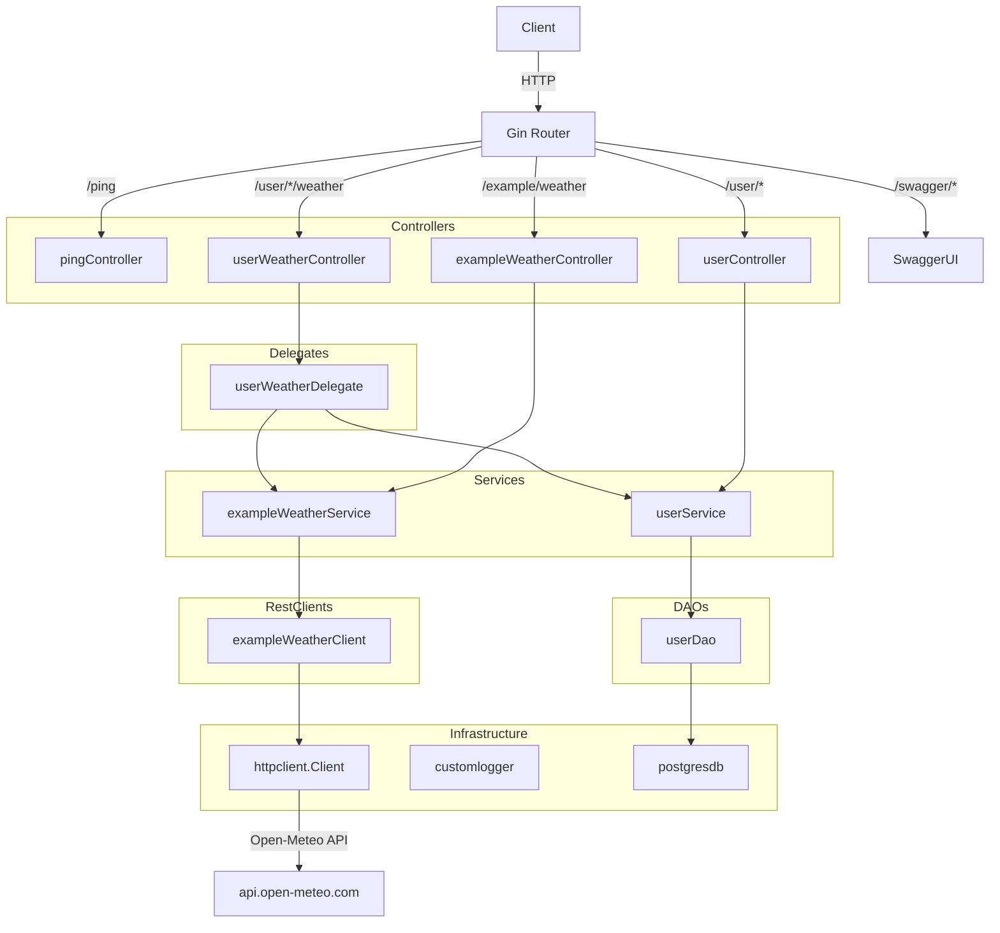
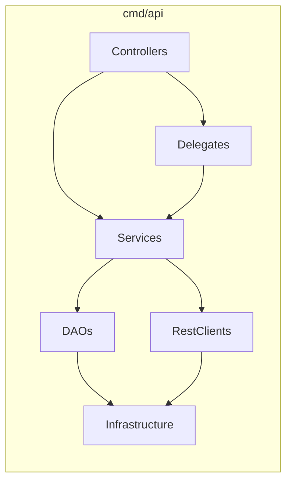
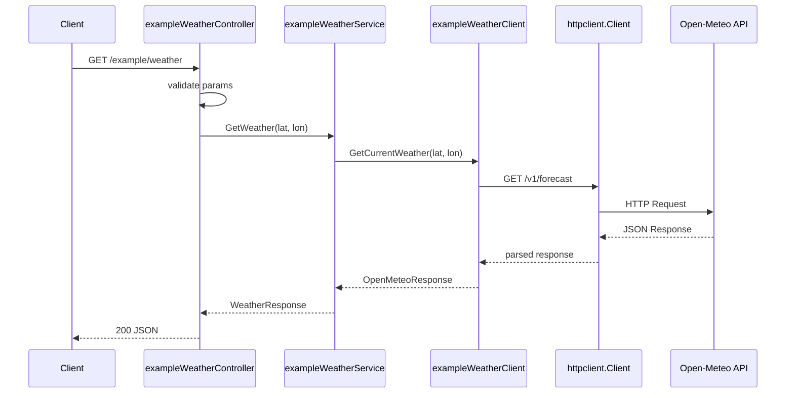

# simple-arq-golang

> Desarrollado por **sintex-dev** © 2026
> Contacto: [sintex.dev@gmail.com](mailto:sintex.dev@gmail.com)

Base scaffolding for Go APIs with Gin framework.

## Architecture



## Layer structure



## Request flow

### Example: `GET /example/weather?latitude=-31.42&longitude=-64.18`



## Endpoints

| Method | Path | Description |
|--------|------|-------------|
| GET | `/ping` | Health check |
| GET | `/user/:user_id` | Get user by ID |
| POST | `/user` | Create user |
| GET | `/example/weather` | Get weather from Open-Meteo |
| GET | `/user/:user_id/weather` | Get user with weather data |
| GET | `/swagger/*any` | Swagger UI |

## Run

```bash
go run cmd/api/main.go
```

## Swagger

After running, open http://localhost:8080/swagger/index.html

## Test

```bash
go test ./...
```
