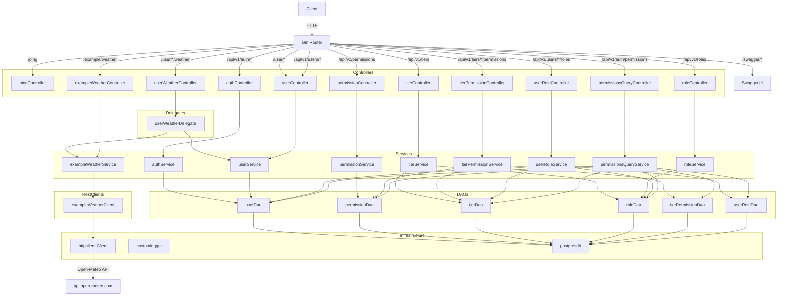
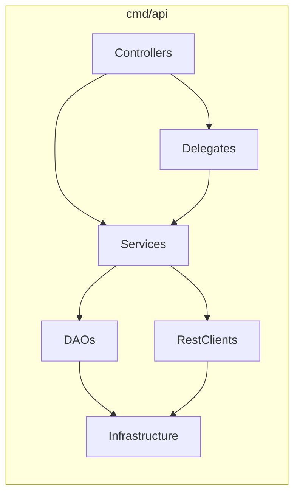
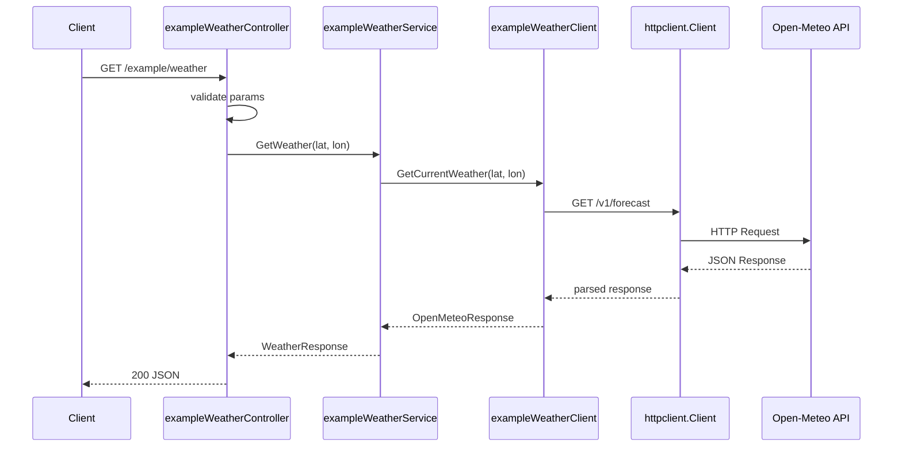

# paceron-backend

API backend con arquitectura en capas (Controllers → Services → DAOs/RestClients → Infrastructure) usando Go + Gin.

## Documentación

| Archivo | Descripción |
|---------|-------------|
| [`SETUP.md`](SETUP.md) | Setup local para nuevos desarrolladores |
| [`STRUCTURE_PACKAGE.md`](STRUCTURE_PACKAGE.md) | Estructura de carpetas con descripciones |
| [`STRUCTURE_FOLDERS.md`](STRUCTURE_FOLDERS.md) | Mapa arquitectónico solo con carpetas |
| [`cmd/api/docs/documentationdetail/STRUCTURE.md`](cmd/api/docs/documentationdetail/STRUCTURE.md) | Árbol del proyecto en español |
| [`cmd/api/docs/documentationdetail/CONVENTIONS.md`](cmd/api/docs/documentationdetail/CONVENTIONS.md) | Convenciones de código en español |
| [`cmd/api/docs/documentationdetail/WORKFLOW.md`](cmd/api/docs/documentationdetail/WORKFLOW.md) | Flujo de trabajo en español |
| [`cmd/api/docs/documentationdetail/GLOSSARY.md`](cmd/api/docs/documentationdetail/GLOSSARY.md) | Glosario detallado en español |
| [`.agentics/`](.agentics/) | Documentación técnica para asistentes de IA (inglés) |
| [`openspec/`](openspec/) | Configuración y cambios de OpenSpec (spec-driven development) |
| [`.opencode/`](.opencode/) | Skills y comandos para OpenCode |
| [`.qwen/`](.qwen/) | Skills y comandos para Qwen Code |

## Project root

```
ci/               Artefactos de CI/CD (cobertura, scripts)
.agentics/        Documentación para asistentes de IA
cmd/api/          Código fuente de la API
```

## Architecture


```mermaid
graph TB
    Client[Client] --> |HTTP| Router[Gin Router]

    subgraph Controllers
        PingController[pingController]
        AuthController[authController]
        UserController[userController]
        WeatherController[exampleWeatherController]
        UserWeatherController[userWeatherController]
        PermissionController[permissionController]
        TierController[tierController]
        RoleController[roleController]
        TierPermissionController[tierPermissionController]
        UserRoleController[userRoleController]
        PermissionsQueryController[permissionsQueryController]
    end

    subgraph Delegates
        UserWeatherDelegate[userWeatherDelegate]
    end

    subgraph Services
        AuthService[authService]
        UserService[userService]
        WeatherService[exampleWeatherService]
        PermissionService[permissionService]
        TierService[tierService]
        RoleService[roleService]
        TierPermissionService[tierPermissionService]
        UserRoleService[userRoleService]
        PermissionsQueryService[permissionsQueryService]
    end

    subgraph DAOs
        UserDAO[userDao]
        PermissionDAO[permissionDao]
        TierDAO[tierDao]
        RoleDAO[roleDao]
        TierPermissionDAO[tierPermissionDao]
        UserRoleDAO[userRoleDao]
    end

    subgraph RestClients
        WeatherClient[exampleWeatherClient]
    end

    subgraph Infrastructure
        HTTPClient[httpclient.Client]
        Logger[customlogger]
        DB[postgresdb]
    end

    Router --> |/ping| PingController
    Router --> |/api/v1/auth/*| AuthController
    Router --> |/user/*| UserController
    Router --> |/api/v1/users/*| UserController
    Router --> |/example/weather| WeatherController
    Router --> |/user/*/weather| UserWeatherController
    Router --> |/api/v1/permissions| PermissionController
    Router --> |/api/v1/tiers| TierController
    Router --> |/api/v1/roles| RoleController
    Router --> |/api/v1/tiers/*/permissions| TierPermissionController
    Router --> |/api/v1/users/*/roles| UserRoleController
    Router --> |/api/v1/auth/permissions| PermissionsQueryController
    Router --> |/swagger/*| SwaggerUI

    UserWeatherController --> UserWeatherDelegate
    UserWeatherDelegate --> UserService
    UserWeatherDelegate --> WeatherService
    AuthController --> AuthService
    UserController --> UserService
    WeatherController --> WeatherService
    PermissionController --> PermissionService
    TierController --> TierService
    RoleController --> RoleService
    TierPermissionController --> TierPermissionService
    UserRoleController --> UserRoleService
    PermissionsQueryController --> PermissionsQueryService
    AuthService --> UserDAO
    UserService --> UserDAO
    PermissionService --> PermissionDAO
    TierService --> TierDAO
    TierService --> RoleDAO
    RoleService --> RoleDAO
    TierPermissionService --> TierPermissionDAO
    TierPermissionService --> TierDAO
    TierPermissionService --> PermissionDAO
    UserRoleService --> UserRoleDAO
    UserRoleService --> RoleDAO
    UserRoleService --> TierDAO
    UserRoleService --> UserDAO
    PermissionsQueryService --> UserDAO
    PermissionsQueryService --> UserRoleDAO
    PermissionsQueryService --> RoleDAO
    PermissionsQueryService --> TierDAO
    PermissionsQueryService --> TierPermissionDAO
    PermissionsQueryService --> PermissionDAO
    UserDAO --> DB
    PermissionDAO --> DB
    TierDAO --> DB
    RoleDAO --> DB
    TierPermissionDAO --> DB
    UserRoleDAO --> DB
    WeatherService --> WeatherClient
    WeatherClient --> HTTPClient
    HTTPClient --> |Open-Meteo API| ExternalAPI[api.open-meteo.com]
```

## Layer structure


```mermaid
graph LR
    subgraph cmd/api
        direction TB
        Controllers --> Delegates
        Controllers --> Services
        Delegates --> Services
        Services --> DAOs
        Services --> RestClients
        DAOs --> Infrastructure
        RestClients --> Infrastructure
    end
```

## Request flow

### Example: `GET /example/weather?latitude=-31.42&longitude=-64.18`


```mermaid
sequenceDiagram
    participant C as Client
    participant CTRL as exampleWeatherController
    participant SVC as exampleWeatherService
    participant CLI as exampleWeatherClient
    participant HTTP as httpclient.Client
    participant EXT as Open-Meteo API

    C->>CTRL: GET /example/weather
    CTRL->>CTRL: validate params
    CTRL->>SVC: GetWeather(lat, lon)
    SVC->>CLI: GetCurrentWeather(lat, lon)
    CLI->>HTTP: GET /v1/forecast
    HTTP->>EXT: HTTP Request
    EXT-->>HTTP: JSON Response
    HTTP-->>CLI: parsed response
    CLI-->>SVC: OpenMeteoResponse
    SVC-->>CTRL: WeatherResponse
    CTRL-->>C: 200 JSON
```

## Endpoints

| Method | Path | Description |
|--------|------|-------------|
| GET | `/ping` | Health check |
| POST | `/api/v1/auth/register` | Register new user (name, surname, email, dni, birth_date, password + optional fields) |
| POST | `/api/v1/auth/login` | Login with email/password, returns JWT access + refresh tokens |
| GET | `/api/v1/auth/user?id=&email=` | Get user by ID or email |
| GET | `/api/v1/auth/permissions?user_id=` | Get user permissions with roles and tiers |
| GET | `/user/:user_id` | Get user by ID (legacy) |
| POST | `/user` | Create user (legacy) |
| PUT | `/api/v1/users/:id` | Update user attributes (email change requires X-Current-Password header) |
| PATCH | `/api/v1/users/:id/status` | Change user status (active/inactive/pause/blocked/suspended) |
| POST | `/api/v1/users/:id/roles` | Assign role to user (with optional tier, default "base") |
| GET | `/api/v1/permissions` | List all permissions |
| GET | `/api/v1/permissions/:id` | Get permission by ID |
| GET | `/api/v1/permissions/by-name?name=` | Get permission by unique name |
| POST | `/api/v1/permissions` | Create permission |
| PUT | `/api/v1/permissions/:id` | Update permission |
| DELETE | `/api/v1/permissions/:id` | Soft delete permission |
| GET | `/api/v1/tiers` | List all tiers |
| GET | `/api/v1/tiers/:id` | Get tier by ID |
| GET | `/api/v1/tiers/by-name?name=` | Get tier by name |
| POST | `/api/v1/tiers` | Create tier for a role |
| PUT | `/api/v1/tiers/:id` | Update tier |
| DELETE | `/api/v1/tiers/:id` | Soft delete tier |
| POST | `/api/v1/tiers/:id/permissions` | Assign permission to tier |
| DELETE | `/api/v1/tiers/:id/permissions/:permission_id` | Unassign permission from tier |
| GET | `/api/v1/roles` | List all roles |
| GET | `/api/v1/roles/:id` | Get role by ID |
| GET | `/api/v1/roles/by-name?name=` | Get role by unique name |
| POST | `/api/v1/roles` | Create role |
| PUT | `/api/v1/roles/:id` | Update role |
| DELETE | `/api/v1/roles/:id` | Soft delete role |
| GET | `/example/weather` | Get weather from Open-Meteo |
| GET | `/user/:user_id/weather` | Get user with weather data |
| GET | `/swagger` | Swagger UI |

## Run

```bash
go run cmd/api/main.go
```

> Para setup completo ver [`SETUP.md`](SETUP.md).

## Swagger

After running, open http://localhost:8080/swagger/index.html

## Test

```bash
go test ./...
```

---

*Arquitectura basada en **simple-arq-golang** diseñada por [sintex-dev](https://github.com/sintex-dev/simple-arq-golang) © 2026 — [sintex.dev@gmail.com](mailto:sintex.dev@gmail.com)*

**© 2026 Paceron. Todos los derechos reservados.**  
Todo el contenido, código y documentación de este repositorio son propiedad exclusiva de **Paceron** y sus miembros. Queda prohibida su reproducción, distribución o uso sin autorización expresa.
